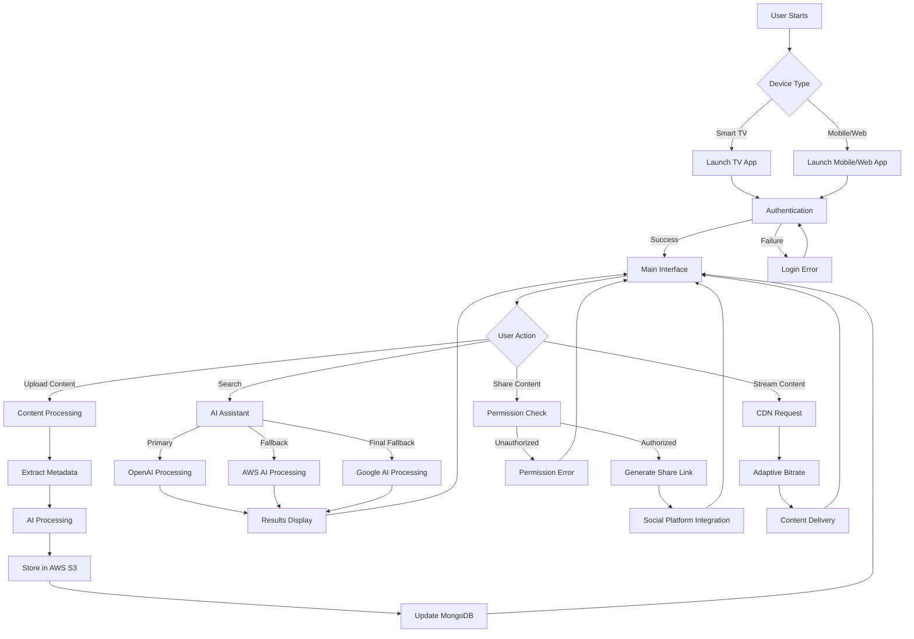
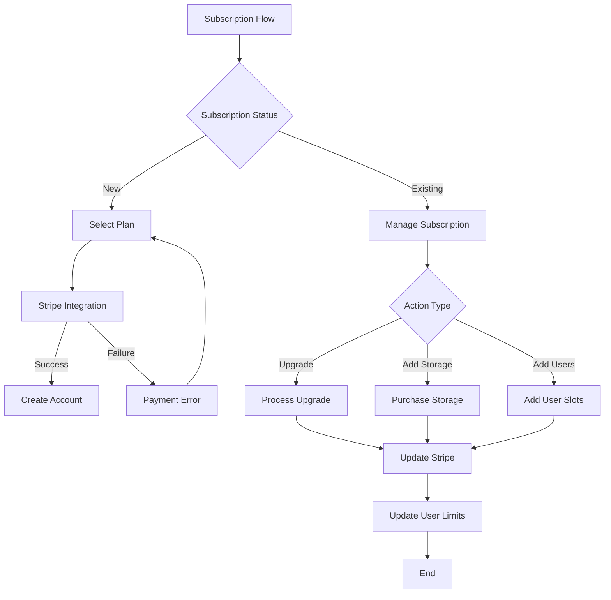
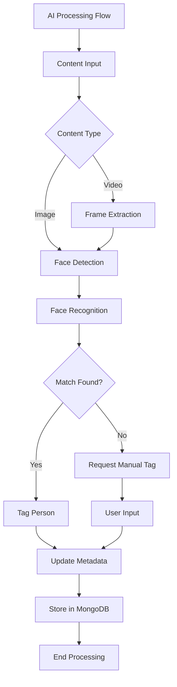
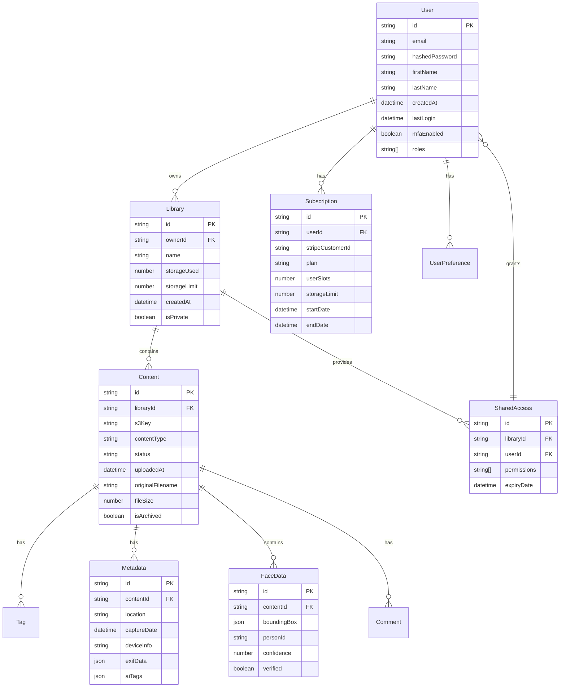
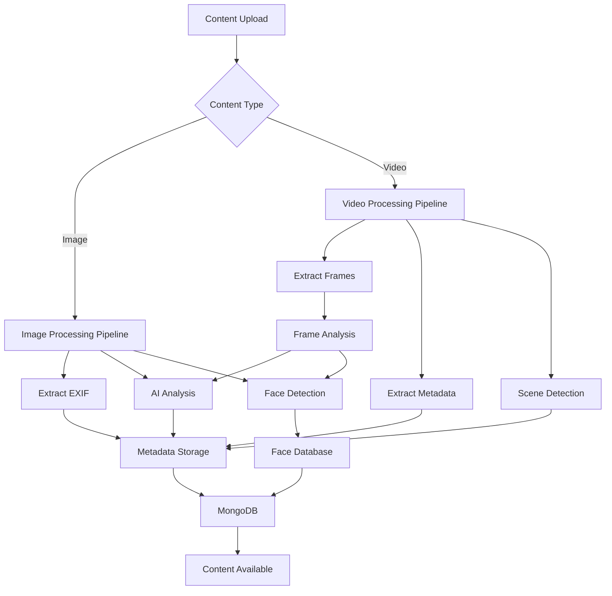
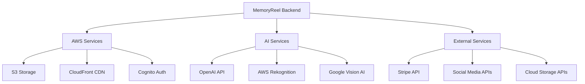

# Product Requirements Document (PRD)

# 1. INTRODUCTION

## 1.1 Purpose

This Software Requirements Specification (SRS) document provides a comprehensive description of the MemoryReel platform, a Netflix-style video and photo management system. The document is intended for:

- Development teams implementing the system
- Project managers overseeing development
- Quality assurance teams conducting testing
- Stakeholders evaluating project scope and progress
- Third-party integrators working with the MemoryReel API

## 1.2 Scope

MemoryReel is a cloud-based platform that revolutionizes how families organize, discover, and share their digital memories. The system encompasses:

### Core Functionalities

- AI-powered content organization and discovery
- Multi-device streaming with Smart TV focus
- Facial recognition and automated tagging
- Social sharing and collaboration features
- Multi-language support across all interfaces

### Key Benefits

- Simplified memory discovery through AI assistance
- Enhanced family connectivity through shared libraries
- Secure, scalable storage infrastructure
- Seamless multi-platform accessibility
- Automated content organization and categorization

### Technical Boundaries

- Web application built with React.js
- Mobile companion app using React Native
- Smart TV applications for major platforms
- Backend services powered by Node.js and Express.js
- Cloud infrastructure hosted on AWS
- Integration with multiple AI providers for redundancy

### Exclusions

- Physical media digitization services
- Hardware-specific optimizations beyond major platforms
- Custom content editing or manipulation tools
- Direct integration with legacy storage systems

# 2. PRODUCT DESCRIPTION

## 2.1 Product Perspective

MemoryReel operates as a cloud-native SaaS platform within the broader digital memory management ecosystem. The system integrates with:

- Cloud Storage Providers (AWS S3)
- Multiple AI Service Providers (OpenAI, AWS, Google, whatsapp)
- Social Media Platforms (Facebook, Instagram, TikTok)
- Cloud Storage Services (Google Drive, Dropbox)
- Smart TV Platforms (Apple TV, Google Play, Samsung)
- Payment Processing Systems (Stripe)

## 2.2 Product Functions

- AI-Powered Memory Organization

  - Automated content categorization
  - Smart tagging and facial recognition
  - Voice/text-based memory discovery
  - Multi-language content processing

- Content Management

  - Netflix-style browsing interface
  - Multi-device streaming capabilities
  - Metadata extraction and management
  - Collaborative library sharing

- Social Features

  - Family sharing and permissions
  - Social media integration
  - Content reactions and comments
  - External platform sharing

- Platform Administration

  - Subscription management
  - Storage allocation
  - User access control
  - Content moderation

## 2.3 User Characteristics

### Primary Users

- **Family Organizers**
  - Age: 35-55
  - Tech Comfort: Moderate
  - Primary Need: Organizing family memories
  - Usage Pattern: Weekly uploads, daily browsing

### Secondary Users

- **Extended Family Members**
  - Age: 25-75
  - Tech Comfort: Basic to Advanced
  - Primary Need: Viewing and sharing memories
  - Usage Pattern: Occasional viewing and interaction

### Content Contributors

- **Family Photographers**
  - Age: 30-60
  - Tech Comfort: Advanced
  - Primary Need: Bulk uploads and organization
  - Usage Pattern: Regular uploads, heavy categorization

## 2.4 Constraints

### Technical Constraints

- Minimum internet speed requirement: 5 Mbps for streaming
- Storage limitations based on subscription tiers
- Smart TV platform compatibility requirements
- Mobile device OS version requirements (iOS 13+, Android 8+)

### Business Constraints

- Subscription pricing must align with market expectations
- Geographic restrictions for certain AI services
- Data privacy compliance requirements (GDPR, CCPA)
- Third-party API rate limits and costs

### Security Constraints

- Multi-factor authentication requirement
- Encryption standards compliance
- Data retention policies
- Access control limitations

## 2.5 Assumptions and Dependencies

### Assumptions

- Users have reliable internet connectivity
- Most users possess smart devices capable of HD video playback
- Content uploaded meets minimum quality standards
- Users understand basic digital navigation concepts

### Dependencies

- AWS infrastructure availability
- AI service provider uptime
- Third-party API stability
  - Social media platforms
  - Cloud storage services
  - Payment processing
- Smart TV platform SDK compatibility
- Mobile app store approval processes

# 3. PROCESS FLOWCHART

# 4. FUNCTIONAL REQUIREMENTS

## 4.1 AI-Powered Memory Organization (F001)

### Description

Core system for automated content organization and discovery using multi-provider AI services.

### Priority

Critical (P0)

### Requirements

| ID | Requirement | Acceptance Criteria |
| --- | --- | --- |
| F001.1 | Multi-provider AI integration | - Successfully integrate OpenAI (primary), AWS (secondary), and Google AI (tertiary) services - Implement automatic failover between providers - Maximum 2-second response time for provider switching |
| F001.2 | Voice/text search processing | - Support natural language queries in all supported languages - Process complex queries (e.g., "Show me videos with Dad from last summer") - Return relevant results within 3 seconds |
| F001.3 | Automated content categorization | - Tag content with relevant categories (e.g., "Vacation", "Birthday") - 95% accuracy in category assignment - Process new uploads within 5 minutes |
| F001.4 | Facial recognition system | - Detect and recognize faces with 98% accuracy - Create and maintain face database - Allow manual corrections and privacy exclusions |

## 4.2 Content Management System (F002)

### Description

Netflix-style interface for browsing and managing digital memories.

### Priority

Critical (P0)

### Requirements

| ID | Requirement | Acceptance Criteria |
| --- | --- | --- |
| F002.1 | Horizontal scrolling interface | - Smooth scrolling performance (60 fps) - Dynamic loading of content - Category-based organization |
| F002.2 | Multi-device streaming | - Adaptive bitrate streaming - Support for all major platforms - Maximum 2-second initial buffer time |
| F002.3 | Metadata management | - Extract EXIF data automatically - Pre-fill descriptions based on metadata - Support manual metadata editing |
| F002.4 | Content upload system | - Support batch uploads up to 100 files - Progress tracking - Automatic retry on failure |

## 4.3 Social Features (F003)

### Description

Sharing and interaction capabilities within and outside the platform.

### Priority

High (P1)

### Requirements

| ID | Requirement | Acceptance Criteria |
| --- | --- | --- |
| F003.1 | Family sharing | - Granular permission controls - Up to 10 users per premium account - Real-time access updates |
| F003.2 | Social media integration | - Direct sharing to major platforms - Optional watermarking - Share analytics tracking |
| F003.3 | Content import | - OAuth integration with major platforms - Bulk import capabilities - Automatic categorization of imported content |
| F003.4 | Interaction features | - Comments, likes, and reactions - Activity notifications - Content flagging system |

## 4.4 Subscription Management (F004)

### Description

SaaS subscription system with tiered features and storage options.

### Priority

Critical (P0)

### Requirements

| ID | Requirement | Acceptance Criteria |
| --- | --- | --- |
| F004.1 | Payment processing | - Stripe integration - Support multiple currencies - Automated billing cycles |
| F004.2 | Storage management | - Tiered storage limits - Storage usage tracking - Upgrade/downgrade capabilities |
| F004.3 | User management | - User slot allocation - Additional slot purchases - Access level management |
| F004.4 | Subscription tiers | - Feature differentiation by tier - Seamless tier transitions - Proration handling |

## 4.5 Platform Localization (F005)

### Description

Multi-language support across all platform interfaces.

### Priority

High (P1)

### Requirements

| ID | Requirement | Acceptance Criteria |
| --- | --- | --- |
| F005.1 | UI translation | - Support for 10+ major languages - Dynamic language switching - Consistent formatting across languages |
| F005.2 | AI assistant localization | - Multi-language query processing - Localized response generation - Language-specific content recommendations |
| F005.3 | Content metadata | - Multi-language metadata support - Automatic translation of descriptions - Language preference persistence |
| F005.4 | Error messages | - Localized error handling - Cultural sensitivity checks - Context-appropriate messaging |

# 5. NON-FUNCTIONAL REQUIREMENTS

## 5.1 Performance Requirements

| Category | Requirement | Target Metric |
| --- | --- | --- |
| Response Time | API Request Processing | \< 200ms for 95% of requests |
|  | AI Processing Pipeline | \< 3s for content analysis |
|  | Search Results | \< 1s for query completion |
| Throughput | Concurrent Users | Support 100,000 simultaneous users |
|  | Content Upload | Process 1000 uploads/minute |
|  | Streaming Capacity | 10,000 concurrent streams |
| Resource Usage | CPU Utilization | \< 70% under normal load |
|  | Memory Usage | \< 80% of available RAM |
|  | Storage I/O | \< 5ms latency for read operations |

## 5.2 Safety Requirements

| Category | Requirement | Implementation |
| --- | --- | --- |
| Data Backup | Automated Backups | - Daily incremental backups - Weekly full backups - 30-day retention period |
| Disaster Recovery | Recovery Time Objective (RTO) | \< 4 hours for full system recovery |
|  | Recovery Point Objective (RPO) | \< 15 minutes of data loss |
| Fault Tolerance | System Redundancy | - Multi-region deployment - Automatic failover - Load balancing across zones |
| Error Handling | Graceful Degradation | - Fallback AI providers - Cached content delivery - Offline mode support |

## 5.3 Security Requirements

| Category | Requirement | Specification |
| --- | --- | --- |
| Authentication | Multi-Factor Authentication | - Required for all accounts - SMS/Email verification - Biometric support |
| Authorization | Role-Based Access Control | - Granular permission levels - Time-based access tokens - IP-based restrictions |
| Data Protection | Encryption Standards | - AES-256 for stored data - TLS 1.3 for data in transit - End-to-end encryption for sharing |
| Privacy | Data Handling | - GDPR compliance - Data anonymization - Right to be forgotten |
| Monitoring | Security Auditing | - Real-time threat detection - Access logging - Automated vulnerability scanning |

## 5.4 Quality Requirements

| Category | Requirement | Target Metric |
| --- | --- | --- |
| Availability | System Uptime | 99.9% availability (8.76 hours downtime/year) |
| Maintainability | Code Quality | - 80% test coverage - \< 5% technical debt - Automated CI/CD |
| Usability | User Experience | - \< 5 minutes learning curve - \< 3 clicks to main functions - 90% user satisfaction |
| Scalability | System Growth | - 200% peak load handling - Linear cost scaling - Automatic resource scaling |
| Reliability | Error Rate | - \< 0.1% transaction failure - \< 1% API error rate - Zero data loss guarantee |

## 5.5 Compliance Requirements

| Category | Requirement | Standard/Regulation |
| --- | --- | --- |
| Data Privacy | Personal Information | - GDPR (EU) - CCPA (California) - PIPEDA (Canada) |
| Content Storage | Media Retention | - SOC 2 Type II - ISO 27001 - HIPAA compliance |
| Accessibility | Interface Standards | - WCAG 2.1 Level AA - Section 508 compliance - EN 301 549 (EU) |
| Industry Standards | Technical Compliance | - OAuth 2.0 for authentication - OpenAPI 3.0 for APIs - WebRTC for streaming |
| Regional Requirements | Local Regulations | - Data residency requirements - Content rating systems - Export control compliance |

# 6. DATA REQUIREMENTS

## 6.1 Data Models

## 6.2 Data Storage

### Primary Storage

- **Content Storage**: AWS S3
  - Standard tier for frequently accessed content
  - Intelligent-Tiering for optimization
  - Glacier for archived content
- **Metadata Storage**: MongoDB Atlas
  - M30 or higher cluster configuration
  - Multi-region deployment
  - Auto-scaling enabled

### Retention Policies

| Data Type | Active Retention | Archive Period | Deletion Policy |
| --- | --- | --- | --- |
| User Content | Indefinite | Optional user-initiated | 30-day soft delete |
| Metadata | Lifetime of content | Follows content | Immediate with content |
| Face Data | User configurable | Optional opt-out | Immediate on request |
| Usage Logs | 90 days | 1 year | Automated purge |
| Audit Trails | 1 year | 5 years | Compliance-based |

### Backup Strategy

- **Content Backups**

  - Cross-region replication in S3
  - Daily incremental backups
  - Weekly full backups
  - 30-day retention window

- **Database Backups**

  - Continuous replication
  - Point-in-time recovery
  - Geographic redundancy
  - 4-hour recovery SLA

## 6.3 Data Processing

### Security Measures

| Layer | Security Control | Implementation |
| --- | --- | --- |
| Storage | Encryption at Rest | AWS KMS with AES-256 |
| Transit | TLS Encryption | TLS 1.3 with perfect forward secrecy |
| Access | IAM Policies | Role-based with least privilege |
| Processing | Memory Security | Secure memory handling and wiping |
| Backup | Encrypted Backups | Independent encryption keys |

### Data Processing Requirements

| Process | SLA | Resource Allocation |
| --- | --- | --- |
| Image Analysis | \< 5 seconds | 2 vCPU, 4GB RAM |
| Video Analysis | \< 30 seconds/minute | 4 vCPU, 8GB RAM |
| Face Detection | \< 3 seconds/face | 2 vCPU, 4GB RAM |
| Metadata Extraction | \< 1 second | 1 vCPU, 2GB RAM |

# 7. EXTERNAL INTERFACES

## 7.1 User Interfaces

### Web Application Interface

- Responsive design supporting 320px to 4K resolutions
- Built with React.js and TailwindCSS
- Accessibility compliance with WCAG 2.1 Level AA
- Support for dark/light themes and high contrast modes

| Interface Element | Requirements |
| --- | --- |
| Navigation | - Horizontal scrolling carousels - Sticky header with search - Bottom navigation bar on mobile |
| Content Display | - Grid/List view toggle - Adaptive thumbnail sizes - Infinite scroll loading |
| Upload Interface | - Drag-and-drop support - Progress indicators - Batch upload capability |
| Search UI | - Voice input button - Auto-complete suggestions - Filter panels |

### Mobile Application Interface

- React Native implementation
- Native UI components following platform guidelines
- Support for iOS 13+ and Android 8+
- Gesture-based navigation

| Feature | Implementation |
| --- | --- |
| Navigation | - Bottom tab bar - Swipe gestures - Pull-to-refresh |
| Camera Integration | - In-app capture - Gallery picker - QR code scanner |
| TV Remote Control | - Content navigation - Playback controls - Voice command input |

### Smart TV Interface

- Platform-specific SDKs (Apple TV, Google TV, Samsung)
- 10-foot UI design principles
- Remote control optimization
- Focus management system

## 7.2 Hardware Interfaces

### Smart TV Requirements

| Platform | Specifications |
| --- | --- |
| Apple TV | - tvOS 14.0+ - H.264/HEVC decoder support |
| Android TV | - Android TV 9.0+ - VP9 codec support |
| Samsung TV | - Tizen 4.0+ - 4K display support |

### Mobile Device Requirements

| Component | Specification |
| --- | --- |
| Camera | - Minimum 8MP resolution - Auto-focus capability |
| Storage | - 100MB free space for app - External storage access |
| Sensors | - Gyroscope for orientation - Accelerometer for motion |

## 7.3 Software Interfaces

### Cloud Services Integration

### API Integration Requirements

| Service | Integration Type | Purpose |
| --- | --- | --- |
| AWS S3 | AWS SDK v3 | Content storage and retrieval |
| OpenAI | REST API | Primary AI processing |
| Stripe | REST API | Payment processing |
| Social Media | OAuth 2.0 | Content import/sharing |

## 7.4 Communication Interfaces

### Network Protocols

| Protocol | Usage | Requirements |
| --- | --- | --- |
| HTTPS | API Communication | TLS 1.3, Perfect Forward Secrecy |
| WebSocket | Real-time Updates | Socket.io with fallback support |
| WebRTC | Video Streaming | STUN/TURN server configuration |

### Data Exchange Formats

| Format | Usage | Validation |
| --- | --- | --- |
| JSON | API Responses | JSON Schema validation |
| Protocol Buffers | Binary Data | Schema version control |
| JWT | Authentication | RS256 signing algorithm |

### Bandwidth Requirements

| Operation | Minimum Speed | Recommended Speed |
| --- | --- | --- |
| HD Streaming | 5 Mbps | 15 Mbps |
| 4K Streaming | 25 Mbps | 50 Mbps |
| Upload | 2 Mbps | 10 Mbps |
| General Use | 1 Mbps | 5 Mbps |

# 8. APPENDICES

## 8.1 GLOSSARY

| Term | Definition |
| --- | --- |
| Adaptive Bitrate | Technology that adjusts video quality based on network conditions |
| Content Discovery | AI-powered process of finding specific memories using natural language |
| Face Database | Secure storage system for facial recognition data and associated metadata |
| Memory Organization | Automated categorization and tagging of photos and videos |
| Multi-Provider AI | System using multiple AI services with automatic failover capabilities |
| Netflix-style Interface | Horizontal scrolling interface with categorized content rows |
| Vertical Content | Photos or videos captured in portrait orientation (9:16 aspect ratio) |
| Watermarking | Optional branding overlay on shared content for attribution |

## 8.2 ACRONYMS

| Acronym | Expansion |
| --- | --- |
| API | Application Programming Interface |
| AWS | Amazon Web Services |
| CCPA | California Consumer Privacy Act |
| CDN | Content Delivery Network |
| GDPR | General Data Protection Regulation |
| IAM | Identity and Access Management |
| JWT | JSON Web Token |
| KMS | Key Management Service |
| OAuth | Open Authorization |
| PIPEDA | Personal Information Protection and Electronic Documents Act |
| REST | Representational State Transfer |
| S3 | Simple Storage Service |
| SaaS | Software as a Service |
| SDK | Software Development Kit |
| SLA | Service Level Agreement |
| SSL | Secure Sockets Layer |
| STUN | Session Traversal Utilities for NAT |
| TLS | Transport Layer Security |
| TURN | Traversal Using Relays around NAT |
| UI | User Interface |
| WCAG | Web Content Accessibility Guidelines |

## 8.3 ADDITIONAL REFERENCES

### Development Resources

- React.js Documentation: https://reactjs.org/docs
- React Native Documentation: https://reactnative.dev/docs
- TailwindCSS Documentation: https://tailwindcss.com/docs
- MongoDB Atlas Documentation: https://docs.atlas.mongodb.com

### API Documentation

- OpenAI API Reference: https://platform.openai.com/docs
- AWS SDK Documentation: https://docs.aws.amazon.com/sdk-for-javascript
- Stripe API Documentation: https://stripe.com/docs/api

### Standards and Compliance

- WCAG 2.1 Guidelines: https://www.w3.org/WAI/WCAG21/quickref
- GDPR Compliance Checklist: https://gdpr.eu/checklist
- OAuth 2.0 Specification: https://oauth.net/2

### Platform SDKs

- Apple TV Development: https://developer.apple.com/tvos
- Android TV Development: https://developer.android.com/tv
- Samsung Tizen TV: https://developer.samsung.com/smarttv

### Security Standards

- OWASP Security Guidelines: https://owasp.org/www-project-web-security-testing-guide
- Cloud Security Alliance: https://cloudsecurityalliance.org/research/guidance