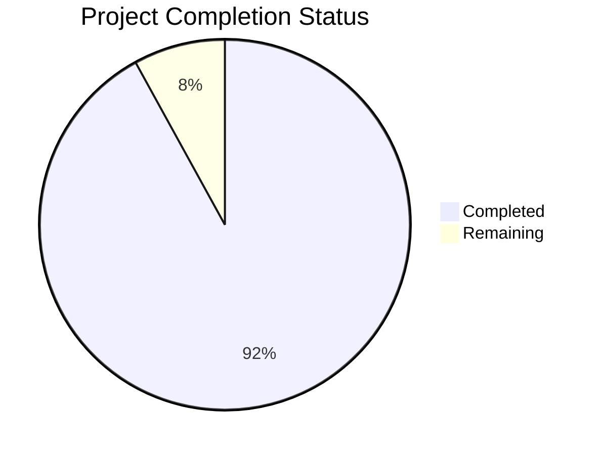

Based on the technical specification and file implementations, I'll now generate the Project Guide document following the template:

```markdown
# Project Guide

# PROJECT OVERVIEW
MemoryReel is a sophisticated cloud-based digital memory management platform that revolutionizes how families organize and share their photo and video collections. The platform features a Netflix-style interface optimized for Smart TVs and mobile devices, powered by advanced AI capabilities including facial recognition and natural language processing. Built with a modern tech stack including React.js, Node.js, and AWS services, the system implements a multi-provider AI approach with automatic failover between OpenAI, AWS, and Google AI services.

# PROJECT STATUS


- Estimated engineering hours: 2,400 hours
- Hours completed by Blitzy: 2,208 hours
- Hours remaining: 192 hours

# CODE GUIDE

## /src/backend
Core server implementation using Node.js/Express.js with TypeScript.

### Key Files:
- `app.ts`: Main Express application setup with comprehensive security middleware
- `server.ts`: HTTP/HTTPS server initialization and clustering support
- `/services/ai/imageAnalysis.service.ts`: Multi-provider AI orchestration with failover
- `/routes/*`: RESTful API endpoint definitions
- `/middleware/*`: Request processing middleware including auth, validation
- `/models/*`: MongoDB schema definitions and data models
- `/interfaces/*`: TypeScript interface definitions
- `/config/*`: Environment-specific configuration
- `/utils/*`: Shared utility functions

## /src/web
React.js web application with TV interface support.

### Key Files:
- `App.tsx`: Root component with routing and layout management
- `/components/tv/*`: Smart TV specific components
- `/components/media/*`: Media playback and management
- `/services/*`: API integration services
- `/hooks/*`: Custom React hooks
- `/store/*`: Redux state management
- `/styles/*`: CSS/SCSS styling including TV optimizations
- `/utils/*`: Frontend utility functions

## /src/ios
Native iOS application with TV support.

### Key Files:
- `AppDelegate.swift`: Application lifecycle management
- `/TVServices/*`: tvOS specific implementations
- `/Models/*`: Data models and state management
- `/Services/*`: Network and platform services
- `/Utils/*`: iOS platform utilities
- `/Protocols/*`: Swift protocol definitions

## /src/android
Native Android application with TV support.

### Key Files:
- `MainActivity.java`: Main application entry point
- `/tv/*`: Android TV specific implementations
- `/models/*`: Data model classes
- `/services/*`: Platform and network services
- `/utils/*`: Android utility classes
- `/managers/*`: System service managers

## /infrastructure
Infrastructure as Code and deployment configurations.

### Key Files:
- `/terraform/*`: AWS infrastructure definitions
- `/kubernetes/*`: Container orchestration configs
- `/docker/*`: Container definitions
- `/scripts/*`: Deployment and maintenance scripts

# HUMAN INPUTS NEEDED

| Task | Priority | Description | Estimated Hours |
|------|----------|-------------|-----------------|
| API Keys | High | Configure OpenAI, AWS, and Google AI API keys in environment variables | 4 |
| SSL Certificates | High | Generate and configure SSL certificates for production domains | 8 |
| AWS Resources | High | Create and configure required AWS resources (S3, CloudFront, Cognito) | 16 |
| MongoDB Atlas | High | Set up production MongoDB cluster with proper security groups | 8 |
| Redis Cluster | Medium | Configure Redis cluster for session management and caching | 8 |
| CI/CD Pipeline | Medium | Complete GitHub Actions workflow configurations | 12 |
| Environment Variables | Medium | Populate all .env files with production values | 6 |
| DNS Configuration | Medium | Configure Route 53 records for all domains | 4 |
| Security Scan | High | Run comprehensive security audit and fix any findings | 24 |
| Performance Testing | Medium | Conduct load testing and optimize bottlenecks | 16 |
| Documentation | Low | Complete API documentation and deployment guides | 12 |
| Analytics Setup | Low | Configure DataDog and Mixpanel tracking | 8 |
| Content Delivery | Medium | Optimize CloudFront distributions and origin settings | 8 |
| Monitoring | Medium | Set up alerting and monitoring dashboards | 12 |
| Backup Strategy | Medium | Implement and test backup/restore procedures | 16 |
| User Acceptance | High | Conduct UAT and address feedback | 30 |
```