# Technical Specifications

# 1. INTRODUCTION

## 1.1 EXECUTIVE SUMMARY

MemoryReel is a cloud-based digital memory management platform that revolutionizes how families organize, discover, and share their photo and video collections. The system addresses the growing challenge of managing vast digital media libraries by providing an AI-powered, Netflix-style interface optimized for Smart TVs and mobile devices. By combining advanced facial recognition, multi-provider AI processing, and intuitive content organization, MemoryReel enables families to effortlessly preserve and relive their most precious moments.

The platform serves family organizers, content contributors, and extended family members through a subscription-based model, offering secure storage, intelligent content discovery, and seamless sharing capabilities. With an estimated market of 130 million households in primary target regions, MemoryReel aims to achieve 15% market penetration within three years.

## 1.2 SYSTEM OVERVIEW

### Project Context

| Aspect | Description |
| --- | --- |
| Market Position | Premium family-oriented digital memory platform with AI-first approach |
| Target Segment | Tech-comfortable families seeking organized, accessible digital memories |
| Competitive Edge | Multi-provider AI redundancy, Smart TV focus, Netflix-style UX |
| Enterprise Integration | Cloud-native architecture with extensible API framework |

### High-Level Description

| Component | Implementation |
| --- | --- |
| Frontend Layer | React.js (web/TV), React Native (mobile) |
| Backend Services | Node.js/Express.js microservices |
| Storage Infrastructure | AWS S3 with CloudFront CDN |
| AI Processing | OpenAI (primary), AWS (secondary), Google (tertiary) |
| Database | MongoDB Atlas for metadata, AWS S3 for media |

### Success Criteria

| Metric | Target |
| --- | --- |
| User Adoption | 100,000 active subscribers in Year 1 |
| Platform Performance | 99.9% uptime, \<2s response time |
| AI Accuracy | 98% facial recognition accuracy |
| User Satisfaction | 90% satisfaction rating |

## 1.3 SCOPE

### In-Scope Elements

#### Core Features

| Category | Features |
| --- | --- |
| Content Management | - AI-powered organization<br>- Multi-device streaming<br>- Automated metadata extraction |
| User Experience | - Netflix-style navigation<br>- Voice/text search<br>- Smart TV optimization |
| AI Capabilities | - Facial recognition<br>- Natural language processing<br>- Content categorization |
| Social Features | - Family sharing<br>- Social media integration<br>- Collaborative libraries |

#### Implementation Boundaries

| Boundary | Coverage |
| --- | --- |
| User Groups | Family organizers, contributors, viewers |
| Geographic Coverage | North America, Europe, Australia (Phase 1) |
| Supported Platforms | iOS, Android, Web, Apple TV, Android TV, Samsung TV |
| Language Support | English, Spanish, French, German, Chinese |

### Out-of-Scope Elements

| Category | Excluded Elements |
| --- | --- |
| Content Creation | - Video editing tools<br>- Photo enhancement features<br>- Custom filter creation |
| Hardware Integration | - Custom hardware solutions<br>- Specialized capture devices<br>- Legacy media digitization |
| Advanced Features | - Professional editing suite<br>- RAW file processing<br>- Custom AI model training |
| Enterprise Features | - White-label solutions<br>- Custom deployment options<br>- Hardware-specific optimizations |

# 2. SYSTEM ARCHITECTURE

## 2.1 High-Level Architecture

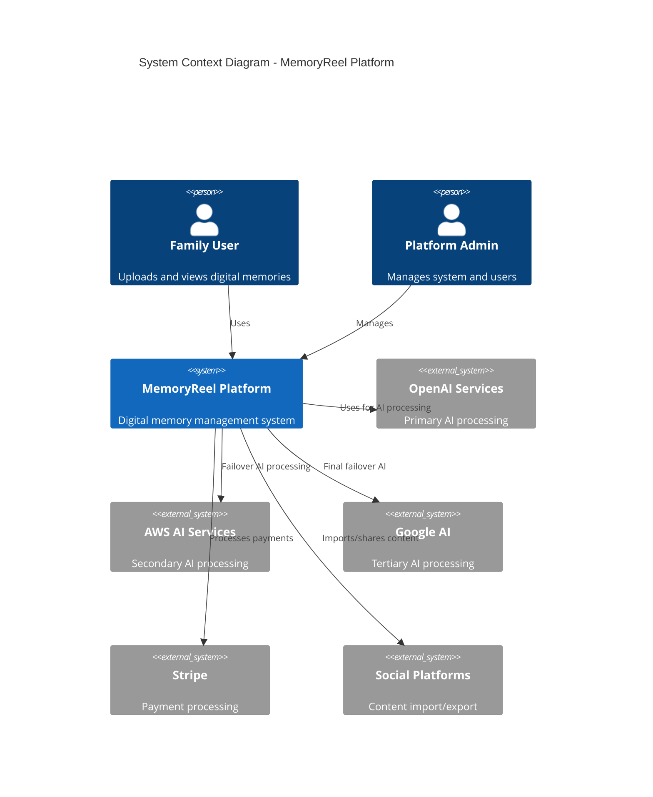

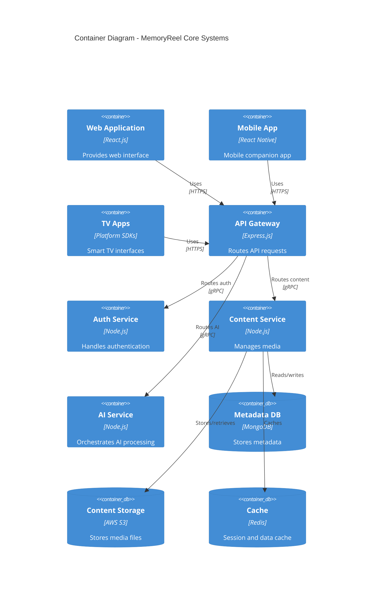

## 2.2 Component Details

### Frontend Components

| Component | Technology | Purpose | Scaling Strategy |
| --- | --- | --- | --- |
| Web App | React.js + TailwindCSS | Primary web interface | Horizontal scaling with CDN |
| Mobile App | React Native | Mobile companion | N/A (client-side) |
| TV Apps | Platform SDKs | Smart TV interface | N/A (client-side) |

### Backend Services

| Service | Technology | Responsibility | Scaling Strategy |
| --- | --- | --- | --- |
| API Gateway | Express.js | Request routing | Horizontal with load balancer |
| Auth Service | Node.js + JWT | Authentication/Authorization | Horizontal with session stickiness |
| Content Service | Node.js | Media management | Horizontal with sharding |
| AI Service | Node.js | AI orchestration | Horizontal with queue-based processing |

### Data Stores

| Store | Technology | Purpose | Scaling Strategy |
| --- | --- | --- | --- |
| Metadata DB | MongoDB Atlas | Structured data | Horizontal sharding |
| Content Storage | AWS S3 | Media files | Automatic with S3 |
| Cache | Redis Cluster | Performance optimization | Master-slave replication |

## 2.3 Technical Decisions

### Architecture Style

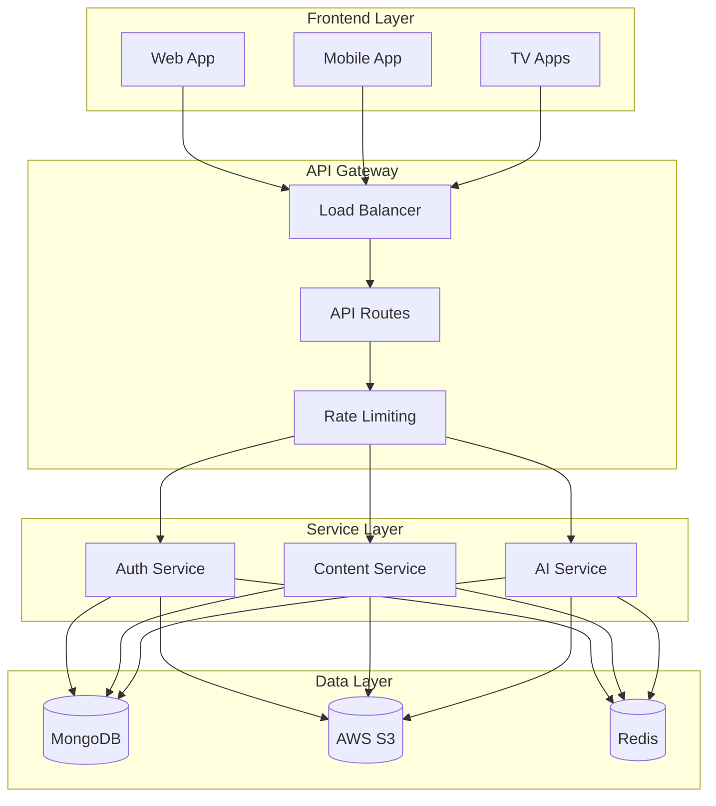

### Communication Patterns

| Pattern | Implementation | Use Case |
| --- | --- | --- |
| Synchronous | REST/GraphQL | User requests |
| Asynchronous | Message Queue | Content processing |
| Event-Driven | WebSocket | Real-time updates |
| Batch Processing | Cron Jobs | AI processing |

## 2.4 Cross-Cutting Concerns

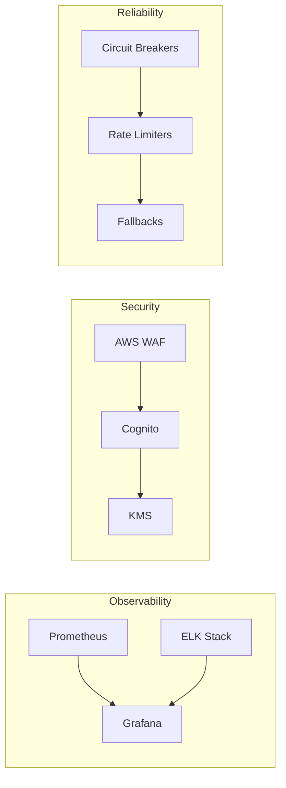

## 2.5 Deployment Architecture

```mermaid
C4Deployment
    title Deployment Diagram - MemoryReel Infrastructure

    Deployment_Node(aws, "AWS Cloud", "Cloud Platform") {
        Deployment_Node(vpc, "VPC", "Network Isolation") {
            Deployment_Node(eks, "EKS Cluster", "Container Orchestration") {
                Container(api, "API Services", "Node.js Containers")
                Container(workers, "Worker Services", "Processing Containers")
            }
            
            Deployment_Node(data, "Data Layer", "Managed Services") {
                ContainerDb(mongo, "MongoDB Atlas", "Document Store")
                ContainerDb(s3_storage, "S3 Buckets", "Media Storage")
                ContainerDb(redis_cache, "Redis Cluster", "Caching Layer")
            }
        }
        
        Deployment_Node(cdn, "CloudFront", "CDN") {
            Container(static, "Static Assets", "Web/Mobile Assets")
        }
    }
    
    Deployment_Node(client, "Client Devices", "End Users") {
        Container(browsers, "Web Browsers", "Web Interface")
        Container(mobile, "Mobile Apps", "iOS/Android")
        Container(tv, "TV Apps", "Smart TV")
    }
    
    Rel(client, cdn, "Requests content", "HTTPS")
    Rel(cdn, api, "API requests", "HTTPS")
    Rel(api, data, "Data operations", "Internal")
```

# 3. SYSTEM COMPONENTS ARCHITECTURE

## 3.1 USER INTERFACE DESIGN

### Design Specifications

| Category | Requirements |
| --- | --- |
| Visual Hierarchy | - Netflix-style horizontal carousels<br>- Card-based content display<br>- Prominent search and AI assistant<br>- Minimalist navigation |
| Design System | - TailwindCSS framework<br>- Custom component library<br>- Consistent spacing (8px grid)<br>- Material Design icons |
| Responsive Design | - Mobile-first approach<br>- Breakpoints: 320px, 768px, 1024px, 1440px, 4K<br>- Fluid typography scaling<br>- Adaptive layouts |
| Accessibility | - WCAG 2.1 Level AA compliance<br>- ARIA landmarks and labels<br>- Keyboard navigation support<br>- Screen reader optimization |

### Interface Elements

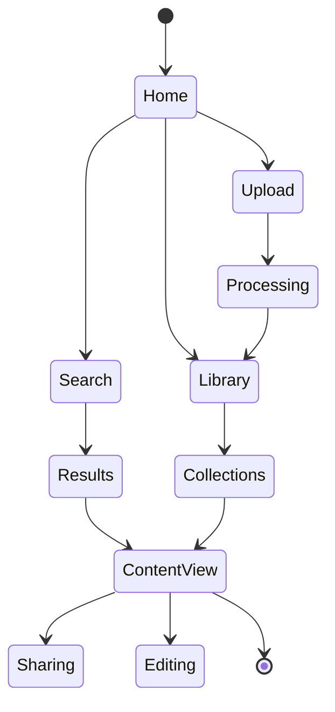

### Critical User Flows

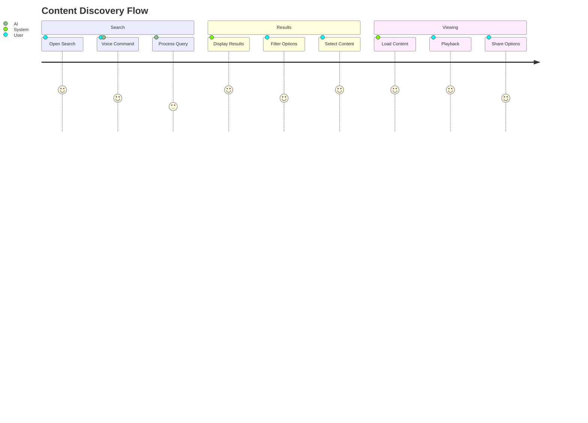

## 3.2 DATABASE DESIGN

### Schema Design

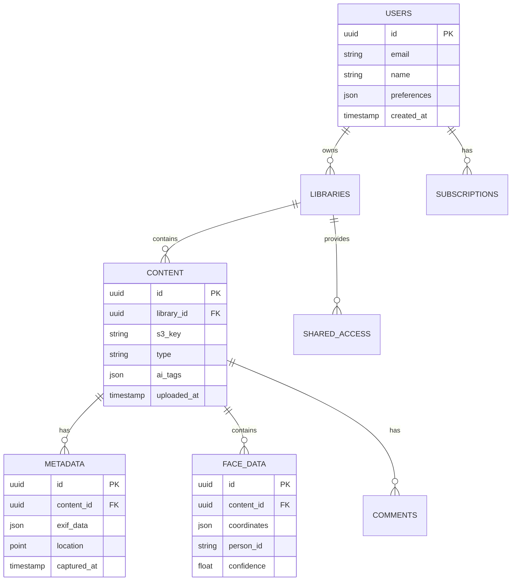

### Data Management Strategy

| Aspect | Implementation |
| --- | --- |
| Partitioning | - Content partitioned by upload date<br>- Metadata sharded by library ID<br>- Face data distributed by person ID |
| Indexing | - B-tree indexes on search fields<br>- Geospatial indexes for location data<br>- Text indexes for content search |
| Caching | - Redis for hot metadata<br>- CloudFront for media content<br>- In-memory caching for AI results |

## 3.3 API DESIGN

### API Architecture

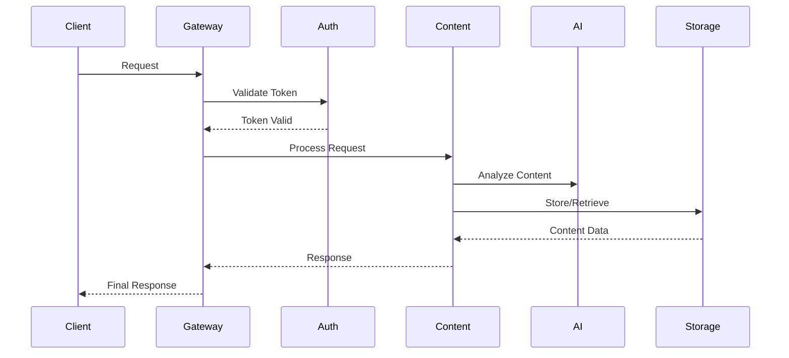

### Interface Specifications

| Endpoint Category | Authentication | Rate Limit | Caching |
| --- | --- | --- | --- |
| Content Upload | JWT Bearer | 100/hour | No Cache |
| Content Retrieval | JWT Bearer | 1000/hour | 1 hour |
| AI Processing | JWT Bearer | 50/hour | 15 minutes |
| Search | JWT Bearer | 200/hour | 5 minutes |
| User Management | JWT Bearer | 20/hour | No Cache |

### Integration Requirements

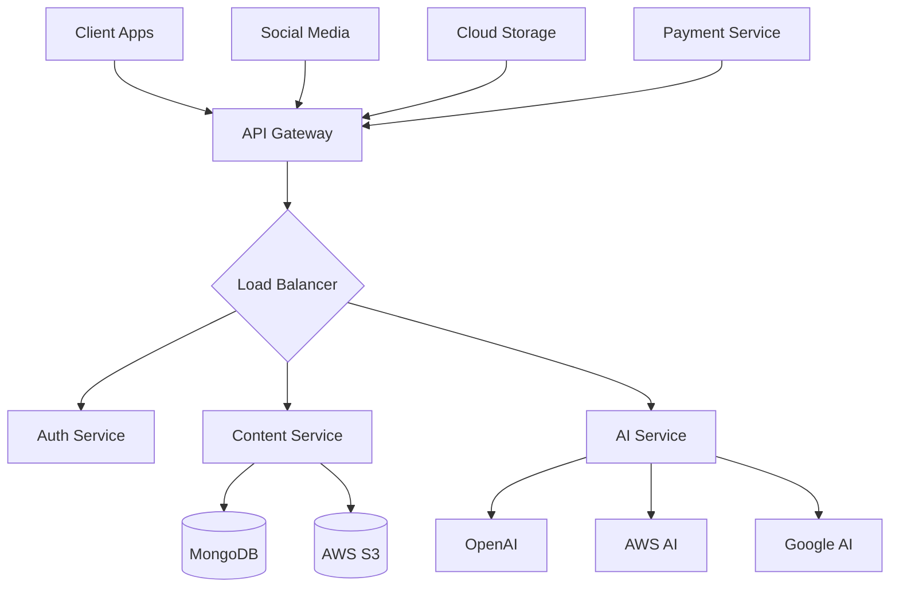

### Security Controls

| Control | Implementation |
| --- | --- |
| Authentication | - JWT with RSA-256<br>- Token refresh mechanism<br>- MFA for sensitive operations |
| Authorization | - Role-based access control<br>- Scope-based permissions<br>- Resource-level ACLs |
| Rate Limiting | - Token bucket algorithm<br>- Per-user and per-IP limits<br>- Graduated throttling |
| Encryption | - TLS 1.3 in transit<br>- AES-256 at rest<br>- Key rotation policy |

# 4. TECHNOLOGY STACK

## 4.1 PROGRAMMING LANGUAGES

| Platform | Language | Version | Justification |
| --- | --- | --- | --- |
| Backend Services | Node.js | 18.x LTS | - Excellent async processing for AI workloads<br>- Rich ecosystem for media handling<br>- Strong TypeScript support |
| Web Frontend | TypeScript | 5.0+ | - Type safety for large-scale application<br>- Enhanced IDE support<br>- Better maintainability |
| Mobile Apps | TypeScript/React Native | 5.0+ | - Code sharing with web platform<br>- Native performance<br>- Single codebase for iOS/Android |
| Smart TV Apps | TypeScript/React | 5.0+ | - Consistent development experience<br>- Platform-specific optimizations<br>- Shared component library |

## 4.2 FRAMEWORKS & LIBRARIES

### Core Frameworks

| Component | Framework | Version | Purpose |
| --- | --- | --- | --- |
| Backend API | Express.js | 4.18+ | - RESTful API implementation<br>- Middleware ecosystem<br>- Performance optimization |
| Web Frontend | React.js | 18.x | - Component-based architecture<br>- Virtual DOM for performance<br>- Large ecosystem |
| Mobile App | React Native | 0.72+ | - Native performance<br>- Code reuse with web<br>- Platform-specific features |
| State Management | Redux Toolkit | 1.9+ | - Centralized state management<br>- TypeScript integration<br>- Performance optimizations |

### Supporting Libraries

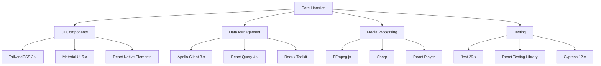

## 4.3 DATABASES & STORAGE

### Primary Data Stores

| Store Type | Technology | Purpose | Scaling Strategy |
| --- | --- | --- | --- |
| Document DB | MongoDB Atlas | User/metadata storage | Horizontal sharding |
| Object Storage | AWS S3 | Media content | Multi-region replication |
| Cache | Redis Cluster | Session/performance | Master-slave distribution |
| Search | Elasticsearch | Content discovery | Cluster with replicas |

### Data Flow Architecture

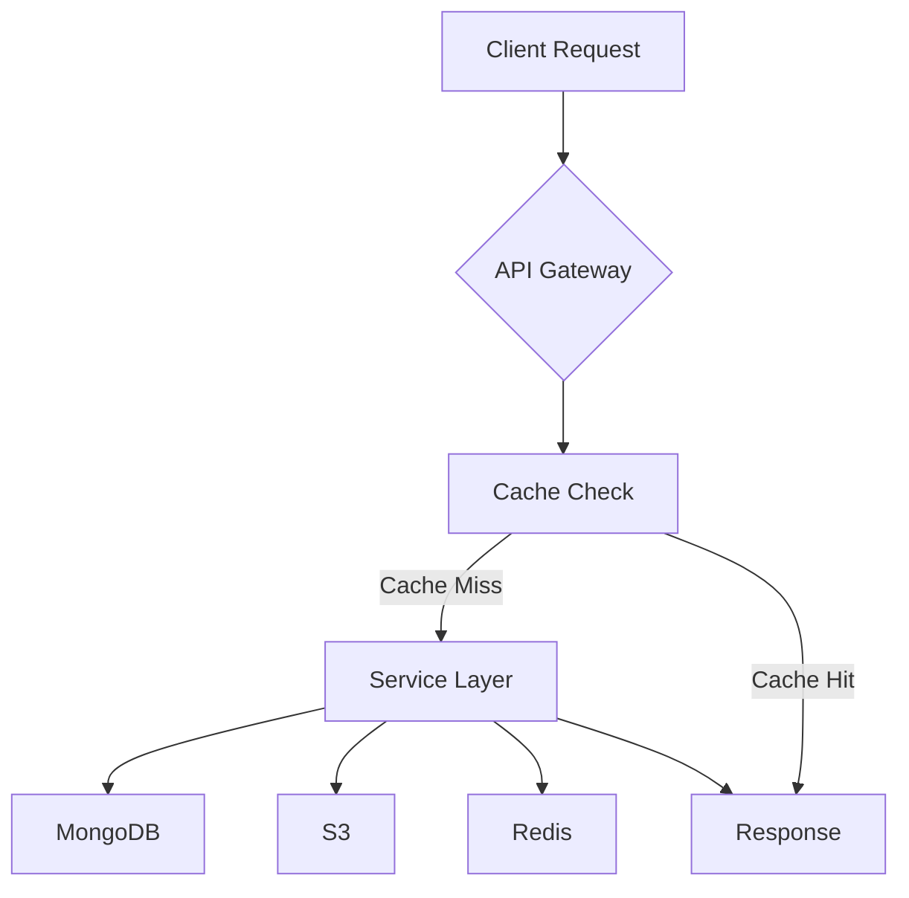

## 4.4 THIRD-PARTY SERVICES

| Category | Service | Purpose | Integration Method |
| --- | --- | --- | --- |
| AI Processing | OpenAI API | Primary AI provider | REST API |
|  | AWS Rekognition | Secondary AI/Face detection | AWS SDK |
|  | Google Vision AI | Tertiary AI provider | REST API |
| Authentication | AWS Cognito | User management | AWS SDK |
| Payments | Stripe | Subscription management | REST API |
| CDN | CloudFront | Content delivery | AWS SDK |
| Monitoring | DataDog | Application monitoring | Agent-based |
| Analytics | Mixpanel | User analytics | SDK |

## 4.5 DEVELOPMENT & DEPLOYMENT

### Development Pipeline

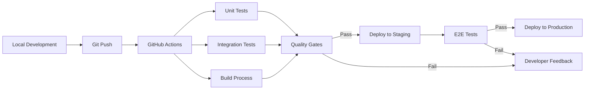

### Infrastructure Components

| Component | Technology | Version | Purpose |
| --- | --- | --- | --- |
| Containers | Docker | 24.x | Application packaging |
| Orchestration | ECS | Latest | Container management |
| IaC | Terraform | 1.5+ | Infrastructure provisioning |
| CI/CD | GitHub Actions | Latest | Automation pipeline |
| Monitoring | DataDog | Latest | System observability |
| Logging | ELK Stack | 8.x | Log aggregation |

### Development Tools

| Category | Tools | Purpose |
| --- | --- | --- |
| IDE | VS Code | Primary development |
| API Testing | Postman | Endpoint validation |
| Performance | Lighthouse | Frontend optimization |
| Security | SonarQube | Code analysis |
| Documentation | Swagger | API documentation |
| Version Control | Git | Source control |

# 5. SYSTEM DESIGN

## 5.1 USER INTERFACE DESIGN

### Smart TV Interface Layout

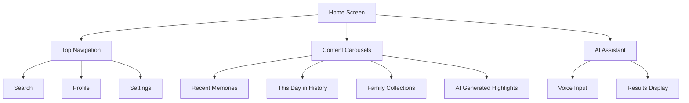

### Mobile Companion Layout

| Screen | Primary Components | Functionality |
| --- | --- | --- |
| Home | - Bottom navigation<br>- Quick upload button<br>- Recent content grid | Navigation hub for all features |
| Upload | - Camera integration<br>- Gallery picker<br>- Progress indicator | Content contribution interface |
| Remote | - TV control pad<br>- Voice command button<br>- Playback controls | Smart TV remote functionality |
| Search | - Voice/text input<br>- Filter options<br>- Results grid | Content discovery interface |

## 5.2 DATABASE DESIGN

### Core Data Models

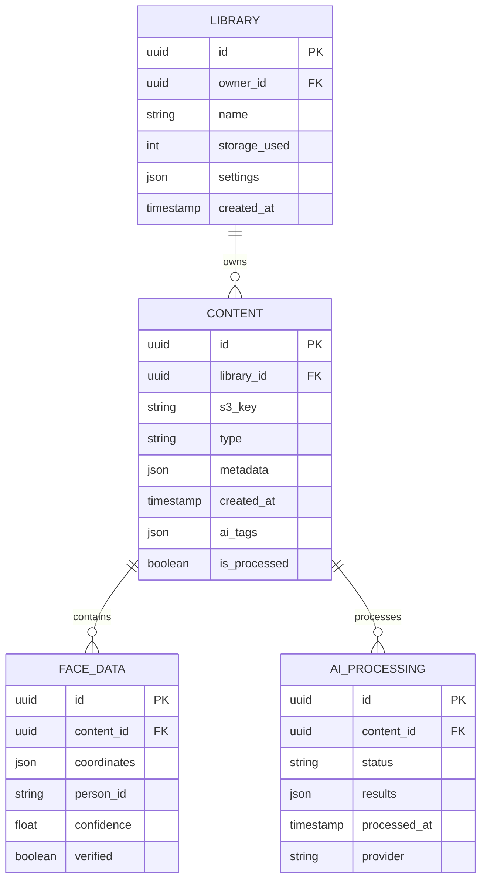

### Indexing Strategy

| Collection | Indexes | Purpose |
| --- | --- | --- |
| content | - s3_key (unique)<br>- library_id + created_at<br>- ai_tags (text) | Efficient content retrieval |
| library | - owner_id + name<br>- storage_used | Library management |
| face_data | - content_id + person_id<br>- confidence | Face recognition queries |
| ai_processing | - content_id + status<br>- provider + status | Processing management |

## 5.3 API DESIGN

### RESTful Endpoints

| Endpoint | Method | Purpose | Authentication |
| --- | --- | --- | --- |
| /api/v1/content | POST | Upload new content | Required |
| /api/v1/content/{id} | GET | Retrieve content | Required |
| /api/v1/library/{id}/content | GET | List library content | Required |
| /api/v1/search | POST | Search content | Required |
| /api/v1/ai/process | POST | Trigger AI processing | Required |

### API Flow Patterns

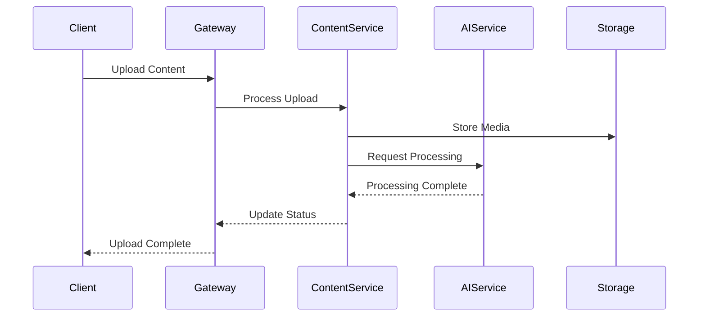

### WebSocket Events

| Event | Direction | Purpose |
| --- | --- | --- |
| content.processed | Server-\>Client | AI processing complete |
| library.updated | Server-\>Client | Library content changed |
| face.detected | Server-\>Client | New face detected |
| remote.command | Client-\>Server | TV remote control |

### Error Handling

| Status Code | Scenario | Response Format |
| --- | --- | --- |
| 400 | Invalid request | {error: string, details: object} |
| 401 | Unauthorized | {error: string, auth_url: string} |
| 429 | Rate limited | {error: string, retry_after: number} |
| 500 | Server error | {error: string, request_id: string} |

## 5.4 SYSTEM INTEGRATION

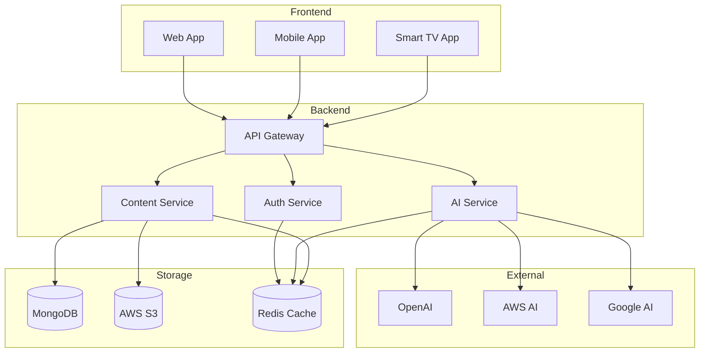

### Integration Points

| Service | Integration Method | Failover Strategy |
| --- | --- | --- |
| OpenAI | REST API with retry | Automatic fallback to AWS |
| AWS Services | SDK with IAM | Multi-region deployment |
| Google AI | gRPC with OAuth | Circuit breaker pattern |
| MongoDB | Native driver | Replica set with auto-failover |
| Redis | Cluster client | Master-slave replication |

# 6. USER INTERFACE DESIGN

## 6.1 Common Elements

### Navigation Bar

```
+----------------------------------------------------------+
| [#] MemoryReel    [Search...]    [@]Profile  [=]Settings  |
+----------------------------------------------------------+
```

### Global Controls Key

```
[#] - Main menu/dashboard
[@] - User profile access
[=] - Settings menu
[?] - Help/documentation
[!] - Notifications/alerts
[x] - Close/exit current view
[<] [>] - Navigation controls
[^] - Upload content
[*] - Favorite/bookmark
[$] - Subscription/payment info
```

## 6.2 Smart TV Interface

### Main Dashboard

```
+----------------------------------------------------------+
| [#] MemoryReel    [Search...] [?]    [@]Profile  [=]Menu  |
+----------------------------------------------------------+
| Recently Added                                    [>]      |
| +--------+  +--------+  +--------+  +--------+            |
| |        |  |        |  |        |  |        |            |
| | IMG 1  |  | IMG 2  |  | IMG 3  |  | IMG 4  |            |
| |        |  |        |  |        |  |        |            |
| +--------+  +--------+  +--------+  +--------+            |
|                                                           |
| This Day in History                              [>]      |
| +--------+  +--------+  +--------+  +--------+            |
| |        |  |        |  |        |  |        |            |
| | VID 1  |  | VID 2  |  | VID 3  |  | VID 4  |            |
| |        |  |        |  |        |  |        |            |
| +--------+  +--------+  +--------+  +--------+            |
|                                                           |
| Family Favorites                                 [>]      |
| +--------+  +--------+  +--------+  +--------+            |
| |        |  |        |  |        |  |        |            |
| | IMG 5  |  | IMG 6  |  | VID 5  |  | IMG 7  |            |
| |        |  |        |  |        |  |        |            |
| +--------+  +--------+  +--------+  +--------+            |
+----------------------------------------------------------+
```

### AI Search Interface

```
+----------------------------------------------------------+
| Voice Search                                               |
| +--------------------------------------------------+      |
| |  "Show me photos with Dad from last summer"       |      |
| +--------------------------------------------------+      |
|                                                           |
| Results:                                                  |
| +--------+  +--------+  +--------+  +--------+            |
| |        |  |        |  |        |  |        |            |
| | Match1 |  | Match2 |  | Match3 |  | Match4 |            |
| |   [*]  |  |   [*]  |  |   [*]  |  |   [*]  |            |
| +--------+  +--------+  +--------+  +--------+            |
|                                                           |
| Filters:                                                  |
| Date: [v] Last Summer                                     |
| People: [x] Dad                                           |
| Type: ( ) Photos  ( ) Videos  (•) All                     |
+----------------------------------------------------------+
```

## 6.3 Mobile Companion App

### Upload Interface

```
+------------------+
| [x] New Upload   |
+------------------+
| Select Source:   |
| [Camera]         |
| [Gallery]        |
| [Cloud Import]   |
|                  |
| Selected: 12     |
| +----+ +----+   |
| |IMG1| |IMG2|   |
| +----+ +----+   |
| +----+ +----+   |
| |IMG3| |IMG4|   |
| +----+ +----+   |
|                  |
| Progress:        |
| [====    ] 40%   |
|                  |
| [Upload Now]     |
+------------------+
```

### TV Remote Control

```
+------------------+
| TV Control       |
+------------------+
|    [^]           |
| [<]   [>]        |
|    [v]           |
|                  |
| [Play/Pause]     |
|                  |
| Volume: [--O--]  |
|                  |
| [Voice Command]  |
|                  |
| Now Playing:     |
| Summer 2023      |
| Album           |
+------------------+
```

## 6.4 Web Interface

### Library Management

```
+----------------------------------------------------------+
| My Libraries                                    [+] New    |
+----------------------------------------------------------+
| +-------------------+  +-------------------+               |
| | Family Photos     |  | Vacation 2023     |               |
| | 1,234 items       |  | 567 items         |               |
| | [Share] [Edit]    |  | [Share] [Edit]    |               |
| +-------------------+  +-------------------+               |
|                                                           |
| Shared With Me                                           |
| +-------------------+  +-------------------+               |
| | Mom's Archive     |  | Smith Family      |               |
| | 891 items         |  | 432 items         |               |
| | [View] [*]        |  | [View] [*]        |               |
| +-------------------+  +-------------------+               |
+----------------------------------------------------------+
```

### Face Recognition Management

```
+----------------------------------------------------------+
| People                                         [+] Add     |
+----------------------------------------------------------+
| Known Faces:                                              |
| +----------+  +----------+  +----------+                   |
| |    [@]   |  |    [@]   |  |    [@]   |                   |
| |   Dad    |  |   Mom    |  |  Sarah   |                   |
| | 234 pics |  | 156 pics |  | 89 pics  |                   |
| +----------+  +----------+  +----------+                   |
|                                                           |
| Suggested Tags:                                           |
| +----------+  +----------+                                |
| |    [@]   |  |    [@]   |                                |
| | Unknown1 |  | Unknown2 |                                |
| | [Verify] |  | [Verify] |                                |
| +----------+  +----------+                                |
+----------------------------------------------------------+
```

## 6.5 Responsive Design Breakpoints

| Device | Width | Layout Adjustments |
| --- | --- | --- |
| Mobile | 320px-767px | Single column, stacked navigation |
| Tablet | 768px-1023px | Two column, side navigation |
| Desktop | 1024px-1439px | Multi-column, horizontal navigation |
| TV/4K | 1440px+ | Optimized for 10-foot UI, large thumbnails |

## 6.6 Accessibility Features

- High contrast mode support
- Screen reader optimization
- Keyboard navigation
- Voice control support
- Customizable text sizing
- Focus indicators
- Alternative text for images
- Closed captions for videos

## 6.7 Theme Support

```
+------------------+
| Theme Settings   |
+------------------+
| Mode:            |
| ( ) Light        |
| (•) Dark         |
| ( ) System       |
|                  |
| Contrast:        |
| [----------O-]   |
|                  |
| Font Size:       |
| [-----O--------] |
|                  |
| [Apply Changes]  |
+------------------+
```

# 7. SECURITY CONSIDERATIONS

## 7.1 AUTHENTICATION AND AUTHORIZATION

### Authentication Flow

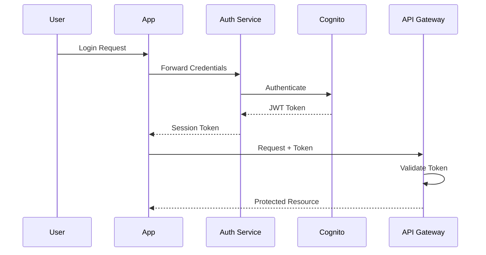

### Authorization Levels

| Role | Permissions | Access Scope |
| --- | --- | --- |
| Admin | Full system access | Global system management |
| Family Organizer | Library management, user invites | Owned libraries + shared |
| Content Contributor | Upload, edit, tag content | Assigned libraries |
| Viewer | View and download content | Shared content only |
| Guest | Limited preview access | Public shared links |

### MFA Implementation

| Method | Implementation | Use Case |
| --- | --- | --- |
| SMS/Email | AWS SNS + Cognito | Primary verification |
| Authenticator Apps | TOTP with QR codes | Enhanced security option |
| Biometric | Device native APIs | Mobile app access |
| Recovery Codes | One-time backup codes | Account recovery |

## 7.2 DATA SECURITY

### Encryption Standards

| Data State | Method | Key Management |
| --- | --- | --- |
| At Rest | AES-256 | AWS KMS with automatic rotation |
| In Transit | TLS 1.3 | Managed certificates with auto-renewal |
| Application Level | End-to-end for sharing | User-specific keys |
| Backup Data | AES-256 with separate keys | Isolated key management |

### Data Classification

| Level | Description | Security Measures |
| --- | --- | --- |
| Critical | Authentication credentials, payment info | Encrypted, access logged |
| Sensitive | Personal photos, videos | Encrypted, restricted access |
| Internal | Metadata, tags | Encrypted, role-based access |
| Public | Marketing content | Signed URLs, caching allowed |

## 7.3 SECURITY PROTOCOLS

### Network Security

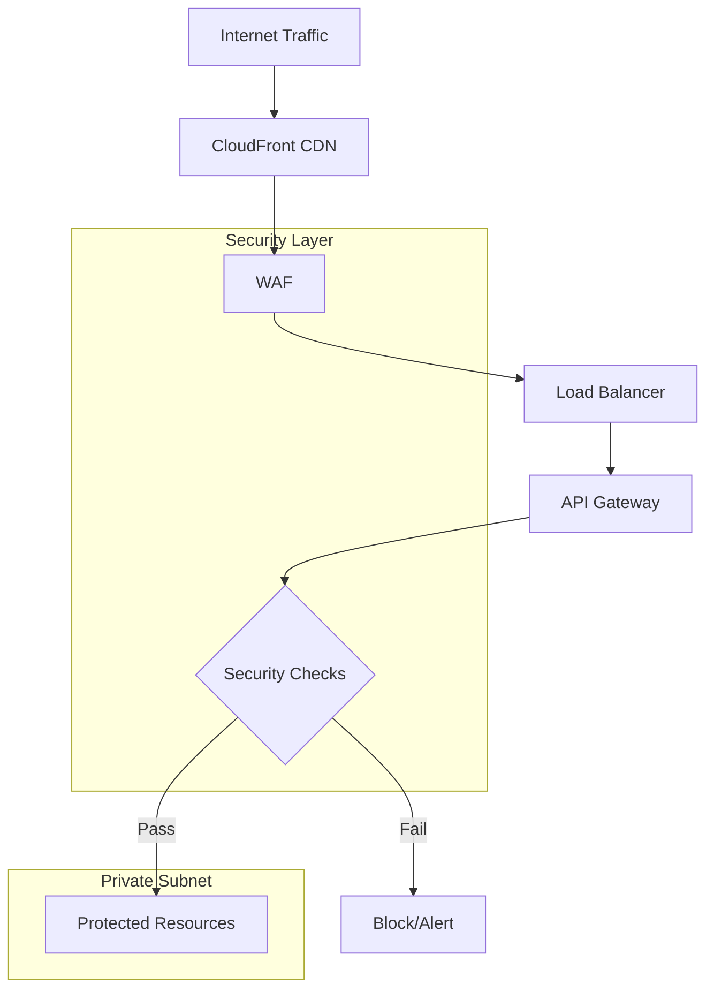

### Security Monitoring

| Component | Tool | Purpose |
| --- | --- | --- |
| WAF Rules | AWS WAF | Block malicious traffic |
| DDoS Protection | AWS Shield | Protect against DDoS |
| Intrusion Detection | GuardDuty | Threat detection |
| Log Analysis | CloudWatch | Security monitoring |
| Vulnerability Scanning | AWS Inspector | Regular security scans |

### Security Compliance

| Standard | Implementation | Verification |
| --- | --- | --- |
| GDPR | Data encryption, access controls | Annual audit |
| CCPA | User consent management | Quarterly review |
| SOC 2 | Security controls, monitoring | External audit |
| HIPAA | Data handling procedures | Compliance check |

### Security Response

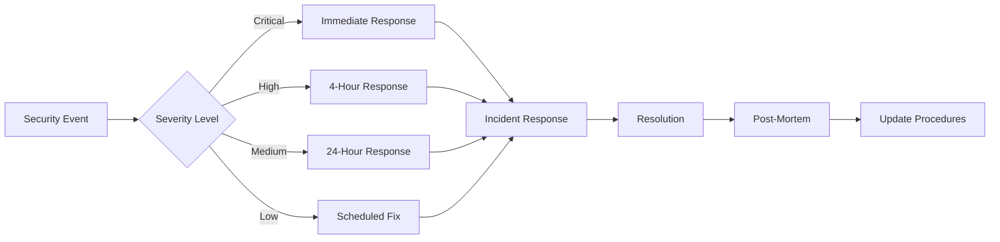

### API Security

| Measure | Implementation | Purpose |
| --- | --- | --- |
| Rate Limiting | Token bucket algorithm | Prevent abuse |
| Input Validation | JSON Schema validation | Prevent injection |
| CORS Policy | Whitelist domains | Control access |
| API Keys | Rotating credentials | Service authentication |

# 8. INFRASTRUCTURE

## 8.1 DEPLOYMENT ENVIRONMENT

### Environment Strategy

| Environment | Purpose | Configuration |
| --- | --- | --- |
| Development | Local development and testing | Docker containers on developer machines |
| Staging | Pre-production testing | AWS ECS with scaled-down resources |
| Production | Live system | Multi-AZ AWS ECS deployment |
| DR Site | Disaster recovery | Cross-region AWS replica |

### Regional Distribution

```mermaid
flowchart TD
    subgraph Primary [Primary Region - US East]
        A[Load Balancer] --> B[ECS Cluster]
        B --> C[(MongoDB Atlas)]
        B --> D[(S3 Primary)]
    end
    
    subgraph Secondary [Secondary Region - US West]
        E[DR Load Balancer] --> F[ECS DR Cluster]
        F --> G[(MongoDB Replica)]
        F --> H[(S3 Replica)]
    end
    
    subgraph Edge [Global Edge]
        I[CloudFront CDN]
        J[Route 53 DNS]
    end
    
    J --> A
    J --> E
    I --> D
    I --> H
```

## 8.2 CLOUD SERVICES

### AWS Service Stack

| Service | Purpose | Configuration |
| --- | --- | --- |
| ECS | Container orchestration | Auto-scaling groups, Spot instances |
| S3 | Media storage | Standard tier + Intelligent tiering |
| CloudFront | Content delivery | Global edge locations, custom domain |
| Route 53 | DNS management | Latency-based routing |
| RDS | Database backup | Multi-AZ deployment |
| ElastiCache | Redis caching | Cluster mode enabled |
| CloudWatch | Monitoring | Custom metrics, alerts |
| WAF | Security | Custom rules, rate limiting |

### Multi-Provider AI Integration

```mermaid
flowchart LR
    A[API Gateway] --> B{Load Balancer}
    B --> C[OpenAI Service]
    B --> D[AWS AI Service]
    B --> E[Google AI Service]
    
    C --> F[Response Aggregator]
    D --> F
    E --> F
    
    F --> G[Cache Layer]
    G --> H[Client Response]
```

## 8.3 CONTAINERIZATION

### Docker Configuration

| Component | Base Image | Purpose |
| --- | --- | --- |
| Frontend | node:18-alpine | Web/TV application serving |
| API Services | node:18-slim | Backend API containers |
| AI Workers | python:3.9-slim | AI processing services |
| Cache | redis:7-alpine | Session and data caching |

### Container Architecture

```mermaid
flowchart TD
    subgraph Services
        A[Frontend Container]
        B[API Container]
        C[Worker Container]
        D[Cache Container]
    end
    
    subgraph Storage
        E[(MongoDB)]
        F[(S3)]
        G[(Redis)]
    end
    
    A --> B
    B --> C
    B --> D
    C --> F
    B --> E
    D --> G
```

## 8.4 ORCHESTRATION

### ECS Configuration

| Component | Configuration | Scaling Policy |
| --- | --- | --- |
| Frontend | 2 vCPU, 4GB RAM | CPU utilization \> 70% |
| API Services | 4 vCPU, 8GB RAM | Request count based |
| AI Workers | 8 vCPU, 16GB RAM | Queue length based |
| Cache | 2 vCPU, 8GB RAM | Memory utilization \> 60% |

### Service Mesh

```mermaid
flowchart TD
    subgraph ECS Cluster
        A[Service Discovery]
        B[Load Balancer]
        C[Auto Scaling]
        
        subgraph Services
            D[Frontend Tasks]
            E[API Tasks]
            F[Worker Tasks]
        end
    end
    
    A --> B
    B --> D
    B --> E
    B --> F
    C --> D
    C --> E
    C --> F
```

## 8.5 CI/CD PIPELINE

### Pipeline Stages

```mermaid
flowchart LR
    A[Code Push] --> B[Build]
    B --> C[Test]
    C --> D[Security Scan]
    D --> E[Deploy Staging]
    E --> F[Integration Tests]
    F --> G[Deploy Production]
    
    B --> H[Docker Build]
    H --> I[Push Registry]
    I --> E
```

### Deployment Configuration

| Stage | Tools | Actions |
| --- | --- | --- |
| Source Control | GitHub | Branch protection, code reviews |
| Build | GitHub Actions | Docker image builds, caching |
| Testing | Jest, Cypress | Unit, integration, E2E tests |
| Security | SonarQube, OWASP | Code analysis, vulnerability scanning |
| Deployment | AWS CDK | Infrastructure as code |
| Monitoring | DataDog | Performance monitoring, alerts |

### Release Strategy

| Type | Frequency | Process |
| --- | --- | --- |
| Hotfix | As needed | Direct to staging, quick verification |
| Feature | Weekly | Full test cycle, staged rollout |
| Major | Monthly | Complete regression, phased deployment |
| Infrastructure | Bi-weekly | Blue-green deployment |

# 8. APPENDICES

## 8.1 ADDITIONAL TECHNICAL INFORMATION

### AI Provider Failover Logic

```mermaid
flowchart TD
    A[AI Request] --> B{OpenAI Available?}
    B -->|Yes| C[Process with OpenAI]
    B -->|No| D{AWS Available?}
    C -->|Success| E[Return Result]
    C -->|Failure| D
    D -->|Yes| F[Process with AWS]
    D -->|No| G{Google AI Available?}
    F -->|Success| E
    F -->|Failure| G
    G -->|Yes| H[Process with Google]
    G -->|No| I[Return Error]
    H -->|Success| E
    H -->|Failure| I
```

### Content Processing Pipeline

| Stage | Processing Steps | Fallback Strategy |
| --- | --- | --- |
| Upload | - Virus scan<br>- Format validation<br>- Size check | Queue retry with exponential backoff |
| Metadata | - EXIF extraction<br>- Location data parsing<br>- Device info capture | Default metadata template |
| AI Analysis | - Face detection<br>- Scene recognition<br>- Content categorization | Manual tagging prompt |
| Storage | - S3 upload<br>- CDN distribution<br>- Backup replication | Local cache with async sync |

## 8.2 GLOSSARY

| Term | Definition |
| --- | --- |
| Adaptive Bitrate Streaming | Dynamic adjustment of video quality based on network conditions |
| Content Carousels | Horizontally scrolling rows of categorized content |
| Face Recognition Database | Secure storage of facial features and associated identities |
| Intelligent Tiering | AWS S3 storage class that automatically moves data between access tiers |
| Memory Discovery | AI-powered search functionality for finding specific content |
| Multi-Provider Redundancy | System using multiple AI services with automatic failover |
| Smart TV Interface | Television-optimized user interface with remote control support |
| Vertical Video Support | Handling of portrait-oriented video content (9:16 aspect ratio) |

## 8.3 ACRONYMS

| Acronym | Full Form |
| --- | --- |
| AI | Artificial Intelligence |
| API | Application Programming Interface |
| AWS | Amazon Web Services |
| CDN | Content Delivery Network |
| EXIF | Exchangeable Image File Format |
| GDPR | General Data Protection Regulation |
| IAM | Identity and Access Management |
| JWT | JSON Web Token |
| KMS | Key Management Service |
| MFA | Multi-Factor Authentication |
| OAuth | Open Authorization |
| REST | Representational State Transfer |
| S3 | Simple Storage Service |
| SaaS | Software as a Service |
| SDK | Software Development Kit |
| SLA | Service Level Agreement |
| SSL | Secure Sockets Layer |
| TLS | Transport Layer Security |
| UI | User Interface |
| UX | User Experience |
| WAF | Web Application Firewall |
| WCAG | Web Content Accessibility Guidelines |

## 8.4 REFERENCE ARCHITECTURE

```mermaid
C4Context
    title Reference Architecture - MemoryReel Platform

    Person(user, "Platform User", "Interacts with system")
    
    System_Boundary(platform, "MemoryReel Platform") {
        Container(frontend, "Frontend Layer", "React.js, React Native")
        Container(api, "API Layer", "Node.js, Express.js")
        Container(processing, "Processing Layer", "AI Services")
        Container(storage, "Storage Layer", "S3, MongoDB")
    }
    
    System_Ext(ai, "AI Providers", "OpenAI, AWS, Google")
    System_Ext(cdn, "CDN", "CloudFront")
    System_Ext(auth, "Authentication", "Cognito")
    
    Rel(user, frontend, "Uses")
    Rel(frontend, api, "API Calls")
    Rel(api, processing, "Process Content")
    Rel(processing, storage, "Store Data")
    Rel(processing, ai, "AI Processing")
    Rel(frontend, cdn, "Content Delivery")
    Rel(api, auth, "Authenticate")
```

## 8.5 COMPLIANCE MATRIX

| Requirement | Implementation | Verification Method |
| --- | --- | --- |
| GDPR Compliance | - Data encryption<br>- Right to be forgotten<br>- Data portability | Annual audit |
| WCAG 2.1 AA | - Screen reader support<br>- Keyboard navigation<br>- Color contrast | Automated testing |
| SOC 2 Type II | - Access controls<br>- Audit logging<br>- Security monitoring | External audit |
| PCI DSS | - Secure payment processing<br>- Data isolation<br>- Regular scanning | Quarterly assessment |